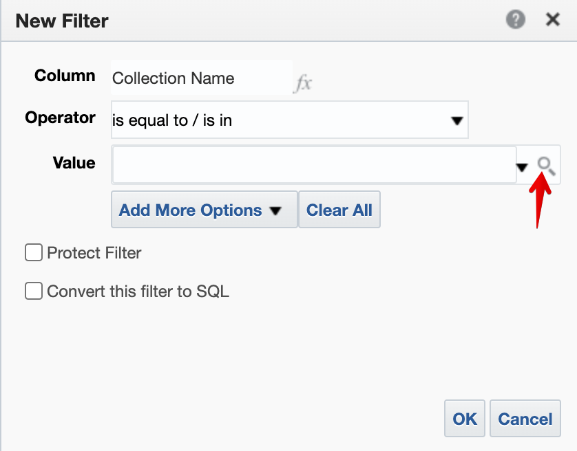
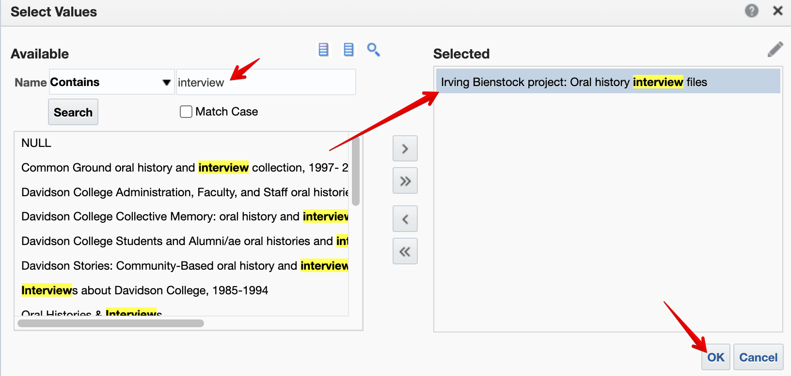
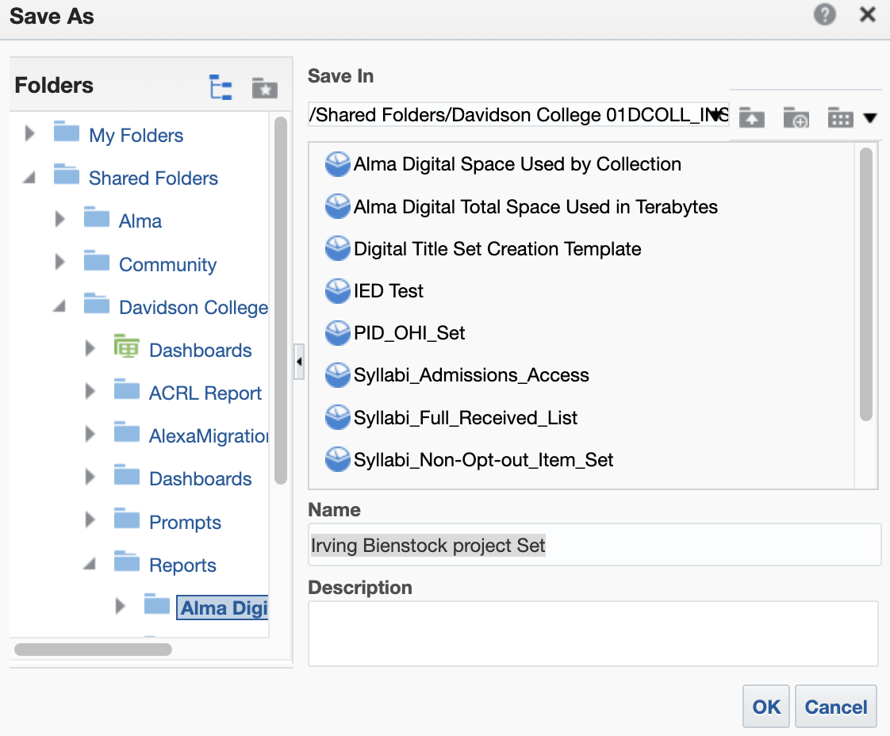

# Create Analysis in Alma Analytics

Click on **Analytics** then **Design Analytics** to open the Oracle Dashboard.

Click on **Catalog** then navigate to the **Alma Digital shared folder** and **click edit** of the analysis titled **"Digital Title Set Creation Template"**

It will by default show you the results, so click the **Criteria** tab at the top-left. Then **click the gear** next to the "Collection Name" column to apply a filter.

Click on the magnifying glass icon to open up the available filter for "Collection Name."

**Search for the Collection Name title** and either **double click it** or **click it once** before **clicking the `>`** to populate the "Selected" box with the collection you want to filter for a set. Finally, **click OK twice.**

The Filters panel will show the collection name. Once you confirm the collection name, **click Results** to make sure the PIDs are displaying.

You'll then see a table with PIDs and Collection Names. Now you will **Save As** a new analysis to keep the template empty of filters. Save it as the Collection Name Set, e.g., Irving Bienstock project Set. _This may go into a sub folder of sets?_

